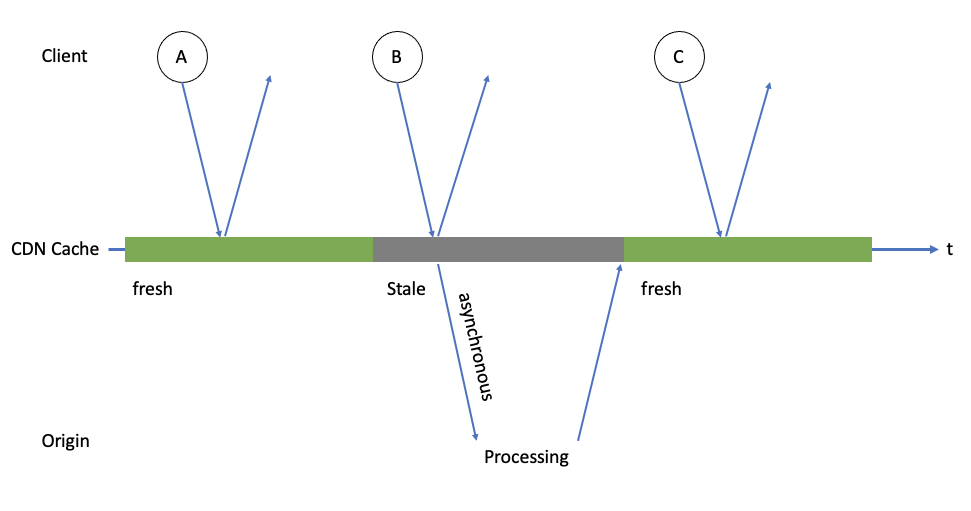

# Worker SWR Plugin

## What is this plugin

This is a plugin to enable [SWR (stale-while-revalidate)](https://web.dev/stale-while-revalidate/) cache control functionality on Cloudflare Workers.  
The SWR cache control model on CDNs is used in Next.js' ISR (incremental static regeneration) and other methods to efficiently return fresh static content to clients.



By using KV as the cache store, this plugin helps you build a global, transparent SWR model that extends beyond the datacenter.

## Setup

```bash
npm install worker-swr-plugin
```

## How to use

Use it in your Worker scripts.  

This is an example of a Worker that processes requests from clients with a cache TTL of 1 hour.
```ts
// index.ts
import makeSWR, { NotMatchedError } from 'worker-swr-plugin'

interface Env {
  CACHE_KV: KVNamespace
}

const handleRequest = async (
  request: Request,
  env: Env,
  context: { waitUntil: (promise: Promise<any>) => void },
): Promise<Response> => {
  const swr = makeSWR(request, env.CACHE_KV, context, {
    ttl: 3600
  })

  return swr.match()
}

export default { fetch: handleRequest }
```

#### Proxy to the origin server

If you need to rewrite hosts or convert paths to forward requests to the origin server, use the proxy option.  
Note that the cache is generated for the URL of the first request received by the CDN.

```ts
// index.ts
import makeSWR, { NotMatchedError } from 'worker-swr-plugin'

interface Env {
  CACHE_KV: KVNamespace
}

// Proxy function to rewrite hostname
const proxy = (req: Request): Rquest => {
  const url = new URL(res.url)
  url.host = 'origin.com'
  return new Request(url.toString(), req)
}

const handleRequest = async (
  request: Request,
  env: Env,
  context: { waitUntil: (promise: Promise<any>) => void },
): Promise<Response> => {
  const swr = makeSWR(request, env.CACHE_KV, context, {
    ttl: 3600,
    proxy
  })

  return swr.match()
}

export default { fetch: handleRequest }
```

#### Force cache revalidation

If the TTL reaches zero and the cache is out of date, it will be automatically re-generated after the response is returned.  
However, there are times when you may want to regenerate the cache without waiting for the expiration date, such as when updating content in the CMS.

You can force a revalidation request as follows.

```ts
// index.ts
import makeSWR, { NotMatchedError } from 'worker-swr-plugin'

interface Env {
  CACHE_KV: KVNamespace
}

const handleRequest = async (
  request: Request,
  env: Env,
  context: { waitUntil: (promise: Promise<any>) => void },
): Promise<Response> => {
  const swr = makeSWR(request, env.CACHE_KV, context, {
    ttl: 3600,
  })

  // Re-cache if there is x-force-revalidate in the header
  return swr.match({
    forceRevalidate: request.headers.has('x-force-revalidate')
  })
}

export default { fetch: handleRequest }
```

You can also run revalidate directly.

```ts
await swr.revalidte()
```

## Contributing

Please read [CONTRIBUTING.md](./CONTRIBUTING.md) for details on our code of conduct, and the process for submitting pull requests to us.

## License

This project is licensed under the Apache License, Version 2.0 - see the [LICENSE](./LICENSE) file for details